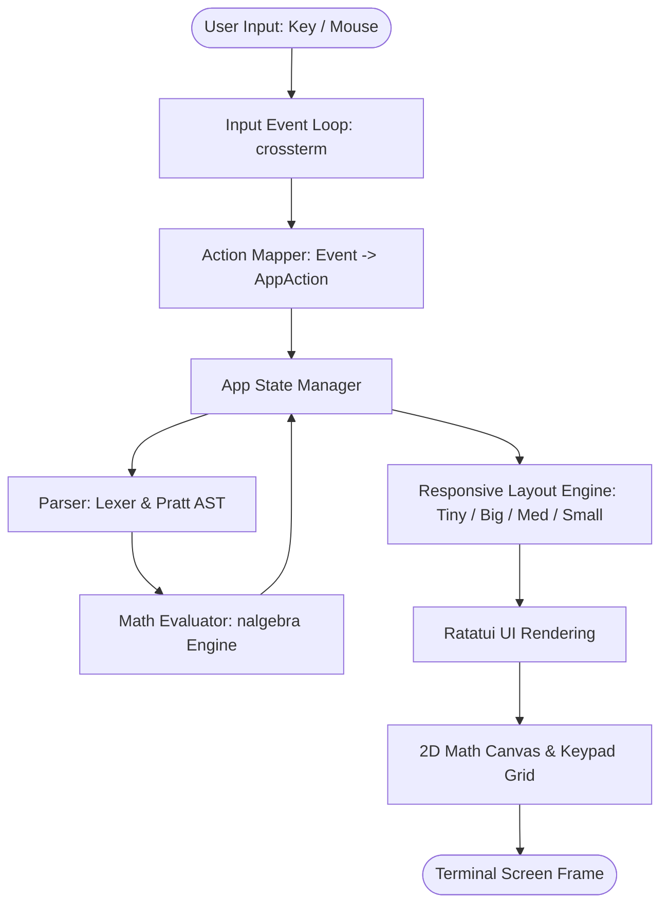

# TUI Calculator - Architecture & Module Design

## Overview
This document outlines the software architecture and module organization for the **TUI Calculator**. The codebase is structured using clean separation of concerns, decoupling state management, mathematical parsing/evaluation, user input translation, and terminal UI rendering.

---

## Directory & Module Structure

In Rust's module system, a directory containing a `mod.rs` file acts as the public entry point for that module folder. `mod.rs` declares submodules and re-exports public structs/enums, giving the rest of the application a clean, unified API.

```
src/
├── main.rs                 # CLI entry point, mode selection, terminal lifecycle
├── app/                    # Central application state & lifecycle
│   ├── mod.rs              # App struct, action handlers, eval bridge
│   ├── editor.rs           # Structured expression editor model + 2D render model
│   ├── history.rs          # Calculation history buffer
│   └── variables.rs        # Memory environment (ans, A-F default 0)
├── config/                 # Configuration & CLI Argument Management
│   ├── mod.rs              # Configuration loader & default manager
│   ├── settings.rs         # TOML schema (~/.config/tui_calculator/config.toml)
│   └── cli.rs              # Clap CLI flags (-s, -m, -b, -h, -v, non-interactive)
├── parser/                 # Expression Tokenization & AST Construction
│   ├── mod.rs              # High-level parse interface (LaTeX & standard syntax)
│   ├── token.rs            # Token definitions (Numbers, Identifiers, LaTeX commands, Ops)
│   ├── lexer.rs            # Character stream tokenizer
│   └── ast.rs              # Abstract Syntax Tree nodes & Pratt Parser implementation
├── eval/                   # Mathematical Evaluation Engine
│   ├── mod.rs              # AST Evaluator engine -> Value result
│   ├── value.rs            # Dynamic Value enum: Scalar(f64), Matrix, Vector
│   └── linear_algebra.rs   # Matrix & Vector ops powered by nalgebra crate
├── ui/                     # Terminal User Interface & Layout Rendering
│   ├── mod.rs              # Responsive layout breakpoint engine (Tiny/Big/Med/Small)
│   ├── canvas.rs           # 2D expression canvas renderer + viewport panning
│   ├── keypad.rs           # Interactive button grid renderer & mouse hit-testing
│   ├── top_bar.rs          # App header, status indicators (DEG/RAD), and debug logs
│   ├── variables_view.rs    # Live variables table panel (A-F & ans)
│   └── help_modal.rs       # Interactive keyboard shortcuts & usage overlay
└── input/                  # Keyboard & Mouse Event Handling
    ├── mod.rs              # Event loop listener (Crossterm)
    └── action.rs           # Crossterm events -> AppAction intent mapping
```

---

## System Architecture & Data Flow



---

## Detailed Module Specifications

### 1. `src/app/` — Application State Management
- **`App` Struct**: Holds editor state, viewport scroll state, evaluation result, error messages, active angle mode (`Deg`/`Rad`), history buffer, variable environment, and configuration settings.
- **`editor.rs`**:
  - Owns the structured input model (character nodes + fraction nodes).
  - Tracks cursor as a path inside nested structures (including numerator/denominator).
  - Produces a 2D render representation consumed by the canvas.
  - Serializes the structured model back to parseable expression text for evaluation.
- **`variables.rs`**: Manages variable registers `ans`, `A`, `B`, `C`, `D`, `E`, `F`. Default value for all variables is `0`. Supports values of type `Scalar`, `Matrix`, or `Vector`.
- **`history.rs`**: Retains past `(expression, result)` calculation tuples.

### 2. `src/config/` — CLI & Configuration Management
- **`cli.rs`**: Powered by `clap`. Handles command-line flags:
  - `-s, --small`, `-m, --medium`, `-b, --big` (force layout)
  - `-h, --help`, `-v, --version`
  - Non-interactive string argument: e.g. `tui_calculator "3 * sin(30deg)"`
- **`settings.rs`**: Uses `serde` + `toml` to load `~/.config/tui_calculator/config.toml`. Sets angle units, decimal precision, color themes, and default layout modes.

### 3. `src/parser/` — Tokenizer & Pratt Parser
- **Dual Syntax Tokenizer**: Lexes standard infix math (`2 + 3 * sin(x)`), matrix bracket notation (`[[1,2],[3,4]]`), and LaTeX commands (`\frac{num}{den}`, `\sqrt{x}`, `\begin{matrix}...`).
- **Pratt AST Construction**: Implements Top-Down Operator Precedence parsing to handle operator precedence (`* / ^` over `+ -`), parentheses grouping, nested functions, and LaTeX blocks.

### 4. `src/eval/` — Mathematical Engine & `nalgebra` Integration
- **`Value` Enum**:
  ```rust
  pub enum Value {
      Scalar(f64),
      Matrix(nalgebra::DMatrix<f64>),
      Vector(nalgebra::DVector<f64>),
  }
  ```
- **Linear Algebra Module**: Connects AST matrix nodes directly to `nalgebra` routines for addition, multiplication, determinant computation (`det`), matrix inversion (`inv`), eigenvalues, eigenvectors, dot products, and cross products.
- **Angle Unit Converter**: Respects configuration setting (`DEG` vs `RAD`), automatically converting trigonometric function inputs/outputs when operating in degrees mode.

### 5. `src/ui/` — Terminal UI & 2D Math Canvas
- **Responsive Layout Engine**: Reads terminal `Rect` dimensions and dynamically chooses between `TinyMode`, `BigMode`, `MediumMode`, and `SmallMode`.
- **2D Math Canvas (`canvas.rs`)**:
  - Renders multiline 2D expressions from the editor render model (including stacked fractions).
  - Uses baseline-aligned inline composition so surrounding expression content aligns with fraction bars.
  - Implements **4-Way Viewport Panning**: Pans horizontally and vertically when 2D expressions exceed visible input bounds.
  - Renders directional scroll arrows (`▲`, `▼`, `◀`, `▶`) on viewport edges.
- **Keypad Renderer & Hit-Testing (`keypad.rs`)**:
  - Maps button rects dynamically to screen bounds.
  - Translates mouse click `(x, y)` coordinates directly to corresponding `Action` intents or input cursor positions.

### 6. `src/input/` — Event Listener & Intent Mapping
- **`action.rs`**: Encapsulates all user intents:
  ```rust
  pub enum AppAction {
      InsertChar(char),
      InsertStr(String),
      InsertFraction,
      InsertSqrt,
      Backspace,
      MoveCursorLeft,
      MoveCursorRight,
      MoveCursorHome,
      MoveCursorEnd,
      ScrollUp,
      ScrollDown,
      ClickAt(u16, u16),
      Evaluate,
      StoreVariable(char), // Shift + Letter
      InsertVariable(char),
      ClearInput,
      AllClear,
      ToggleAngleUnit,
      OpenHelp,
      CloseHelp,
      Quit,
  }
  ```
- **Event Dispatcher**: Translates keyboard inputs (`Shift+A`, `Arrow Keys`, `Enter`, `Esc`, `?`) and Crossterm mouse events (`MouseDown`, `MouseScroll`) into `AppAction` commands executed by `App`.

---

## Dependencies & Cargo Stack

- **`ratatui = "0.29"`**: Terminal User Interface widgets and layout framework.
- **`crossterm = "0.28"`**: Cross-platform terminal control, mouse capture, and keyboard event handling.
- **`clap = { version = "4", features = ["derive"] }`**: Command-line argument parsing.
- **`serde = { version = "1", features = ["derive"] }`** & **`toml = "0.8"`**: Configuration file serialization/deserialization.
- **`nalgebra = "0.33"`**: High-performance linear algebra library for matrix and vector computations.
- **`color-eyre = "0.6"`** & **`thiserror = "1"`**: Error reporting and structured domain error handling.
